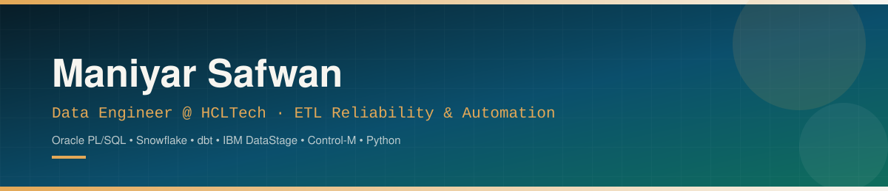

<div align="center">



<br/>

<a href="https://www.linkedin.com/in/maniyar-safwan-62760723a/" target="_blank" rel="noopener noreferrer">
  
</a>

<a href="mailto:mdsafwanmaniyar@gmail.com" target="_blank" rel="noopener noreferrer">
  
</a>

<a href="https://github.com/maniyarsafwan" target="_blank" rel="noopener noreferrer">
  
</a>

<a href="PASTE_YOUR_RESUME_URL_HERE" target="_blank" rel="noopener noreferrer">
  
</a>

<br/><br/>


<br/>

<a href="#-about">About</a> &nbsp;&#183;&nbsp;
<a href="#-currently">Currently</a> &nbsp;&#183;&nbsp;
<a href="#%EF%B8%8F-technical-skills">Skills</a> &nbsp;&#183;&nbsp;
<a href="#-impact-at-a-glance">Impact</a> &nbsp;&#183;&nbsp;
<a href="#-experience-timeline">Timeline</a> &nbsp;&#183;&nbsp;
<a href="#-certifications">Certifications</a> &nbsp;&#183;&nbsp;
<a href="#-resume">Resume</a>

</div>

<br/>


## 🧭 About

I'm currently working as an **Associate Data Engineer at HCLTech**, contributing to a live **USAA client engagement** spanning Oracle PL/SQL, Snowflake, dbt, and IBM DataStage. I take manual, "someone checks this every morning" processes and turn them into automated, self-service systems.

My core focus is **engineering tooling from the ground up** - Python/Flask dashboards, Control-M job-surveillance systems, and scheduled reporting frameworks - that replace manual operational effort with real-time visibility across production pipelines. I've also led platform modernization end-to-end, including a full **Python migration** and CI/CD standardization across a multi-repository DataStage environment, and built REST API tooling to administer and audit **Oracle Integration Cloud (OIC)** assets at scale.

On the reliability side, I resolve ETL/ELT pipeline defects as they surface - isolating malformed-record failures with systematic divide-and-conquer debugging, and redesigning `ORDER BY` / `ROWNUM` logic behind recurring data-integrity defects that silently break downstream reporting.

I'm a Computer Science graduate with hands-on software and web development experience. Academic highlights include a lunar crater image-enhancement initiative for **ISRO** using U-Net architecture on Chandrayaan-2 OHRC data, a Penetration Testing as a Service (PTaaS) platform, and a Snowflake-based data warehouse using Medallion architecture for CDR analytics.

```text
$ whoami
Maniyar Safwan - Data Engineer, debugger of things that "should never happen in production."

$ current_focus
["ETL reliability", "pipeline automation", "GenAI-assisted engineering", "Snowflake + dbt"]
```


## 🧑‍💼 Currently

<table width="100%">
<tr>

<td width="25%" valign="top">

**Role**

Associate Data Engineer

</td>

<td width="25%" valign="top">

**Company**

HCLTech

</td>

<td width="25%" valign="top">

**Client Engagement**

USAA

</td>

<td width="25%" valign="top">

**Since**

September 2025

</td>

</tr>
</table>

| Core Stack | Focus Areas |
|:---|:---|
| Oracle PL/SQL &middot; Snowflake &middot; dbt &middot; IBM DataStage &middot; Control-M &middot; OIC | ETL Reliability &middot; Pipeline Automation &middot; Platform Modernization &middot; GenAI-Assisted Engineering |


## 📈 Impact at a Glance

<table width="100%">
<tr>

<td align="center" width="20%">

### 6+

Production pipelines automated end-to-end

</td>

<td align="center" width="20%">

### 2 → 3

Python platform migration led across multiple repos

</td>

<td align="center" width="20%">

### 100%

Manual DataStage checks replaced by automation

</td>

<td align="center" width="20%">

### 1

Recurring `ORDER BY`/`ROWNUM` defect class root-caused &amp; closed

</td>

<td align="center" width="20%">

### 5+

Certifications across cloud, AI, and databases

</td>

</tr>
</table>


## 🕰️ Experience Timeline

| Period | Milestone |
|:---|:---|
| **Sep 2025 - Present** | Joined HCLTech as Associate Data Engineer on the USAA account; embedded in production ETL support and automation. |
| **2025** | Root-caused a recurring `ORDER BY` / `ROWNUM` defect pattern causing silent data-integrity failures across multiple reporting jobs; redesigned the logic and closed the defect class. |
| **2025** | Led a full **Python** migration with CI/CD standardization across a multi-repository IBM DataStage environment. |
| **2025** | Built REST API tooling to administer and audit **Oracle Integration Cloud (OIC)** assets at scale. |
| **2025** | Designed and shipped Control-M job-surveillance and scheduled-reporting automation, replacing manual daily checks. |
| **2021 - 2025** | B.E. Computer Science - academic work spanning ISRO lunar-imagery enhancement, Snowflake medallion-architecture data warehousing, and security tooling. |


## 🧩 How I Work

> **Find it.** Trace defects to root cause with systematic, divide-and-conquer debugging rather than patching symptoms.

> **Automate it.** Convert manual, recurring operational checks into scheduled, self-service tooling.

> **Harden it.** Standardize CI/CD and coding practices so fixes don't regress across environments.

> **Scale it.** Build reusable tooling (REST API automation, dashboards) rather than one-off scripts.


## 🛠️ Technical Skills

<details open>
<summary><b>Data Engineering</b></summary>
<br/>


</details>

<details open>
<summary><b>Languages</b></summary>
<br/>


</details>

<details open>
<summary><b>Databases</b></summary>
<br/>


</details>

<details open>
<summary><b>Web & Backend</b></summary>
<br/>


</details>

<details open>
<summary><b>AI / ML &amp; Automation</b></summary>
<br/>


</details>

<details open>
<summary><b>Tools &amp; Platforms</b></summary>
<br/>


</details>


## 📜 Certifications

| Certification | Provider |
|---|---|
| 🏅 SnowPro Core Certification | Snowflake |
| 🏅 Generative AI | Percipio (HCLTech) |
| 🏅 Python for Artificial Intelligence / Machine Learning | Udemy |
| 🏅 SQL and Database Design with MySQL | Oracle |
| 🏅 The Complete Python Pro Bootcamp | Udemy |


## 📄 Resume

<div align="center">

<a href="PASTE_YOUR_RESUME_URL_HERE" target="_blank" rel="noopener noreferrer">
  
</a>

</div>


<div align="center">

### 💬 Let's talk data

*Open to conversations on data engineering, cloud platforms, and applied AI.*


</div>


