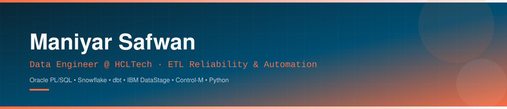
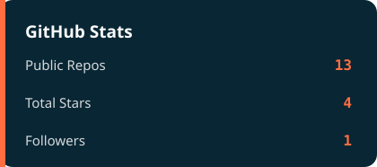
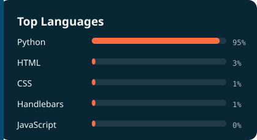

<div align="center">



<br/>

<a href="https://linkedin.com/in/maniyar-safwan">
  
</a>
<a href="mailto:mdsafwanmaniyar@gmail.com">
  
</a>
<a href="https://github.com/maniyarsafwan">
  
</a>

<br/><br/>


</div>

<br/>


<div align="center">
  
</div>

## 🧭 About

I'm currently working as an **Associate Data Engineer at HCLTech**, contributing to a live **USAA client engagement** spanning Oracle PL/SQL, Snowflake, dbt, and IBM DataStage. I take manual, "someone checks this every morning" processes and turn them into automated, self-service systems.

My core focus is **engineering tooling from the ground up** — Python/Flask dashboards, Control-M job-surveillance systems, and scheduled reporting frameworks — that replace manual operational effort with real-time visibility across production pipelines. I've also led platform modernization end-to-end, including a full **Python 2 → 3 migration** and CI/CD standardization across a multi-repository DataStage environment, and built REST API tooling to administer and audit **Oracle Integration Cloud (OIC)** assets at scale.

On the reliability side, I resolve ETL/ELT pipeline defects as they surface — isolating malformed-record failures with systematic divide-and-conquer debugging, and redesigning `ORDER BY` / `ROWNUM` logic behind recurring data-integrity defects that silently break downstream reporting.

I'm a Computer Science graduate with hands-on software and web development experience. Academic highlights include a lunar crater image-enhancement initiative for **ISRO** using U-Net architecture on Chandrayaan-2 OHRC data, a Penetration Testing as a Service (PTaaS) platform, and a Snowflake-based data warehouse using Medallion architecture for CDR analytics.

```text
$ whoami
Maniyar Safwan — Data Engineer, debugger of things that "should never happen in production."

$ current_focus
["ETL reliability", "pipeline automation", "GenAI-assisted engineering", "Snowflake + dbt"]
```

<div align="center">
  
</div>

## 🛠️ Technical Skills

<details open>
<summary><b>Data Engineering</b></summary>
<br/>


</details>

<details open>
<summary><b>Languages</b></summary>
<br/>


</details>

<details open>
<summary><b>Databases</b></summary>
<br/>


</details>

<details open>
<summary><b>Web & Backend</b></summary>
<br/>


</details>

<details open>
<summary><b>AI / ML &amp; Automation</b></summary>
<br/>


</details>

<div align="center">
  
</div>

## 🚀 Featured Projects

<br/>

<table width="100%" cellpadding="0" cellspacing="0" border="0">
<tr>
<td width="49%" valign="top">

<div align="center">

### 🌑 Lunar PSR Image Enhancement
**ISRO · Chandrayaan-2**

</div>

> Applied MRI-based physical models and U-Net architecture to enhance Permanently Shadowed Region imagery from Chandrayaan-2 OHRC data.
>
> **Impact:** `+70%` image clarity &nbsp;·&nbsp; `80%` model success rate
>
> `Python` `U-Net` `Google Colab`
>
> **[→ View Repository](https://github.com/mdsafwanmaniyar/ISRO---EPSR)**

</td>
<td width="2%"></td>
<td width="49%" valign="top">

<div align="center">

### ❄️ Snowflake CDR Analytics
**Medallion Architecture**

</div>

> Built a 3-layer Bronze/Silver/Gold pipeline ingesting 8 raw telecom sources via automated Pipes and Tasks.
>
> **Impact:** `9` Gold-layer KPI views &nbsp;·&nbsp; `100%` ingestion automation
>
> `Snowflake` `SQL` `Star Schema`
>
> **[→ View Repository](https://github.com/mdsafwanmaniyar/AI-Galaxy-Developer)**

</td>
</tr>
<tr><td colspan="3" height="24"></td></tr>
<tr>
<td width="49%" valign="top">

<div align="center">

### 🏥 Hospital Management DB
**Normalized Schema Design**

</div>

> Designed a 1NF–BCNF normalized relational schema spanning 6 modules, 21 entities, and 8 actor roles with dynamic Role-Based Access Control.
>
> **Impact:** `25+` CRUD-mapped agile user stories
>
> `DBML` `Schema Design` `RBAC`

</td>
<td width="2%"></td>
<td width="49%" valign="top">

<div align="center">

### 🛡️ Penetration Testing as a Service
**Automated Security Simulator**

</div>

> Engineered a network attack simulator automating penetration testing workflows with real-time vulnerability scanning and exploit alerting.
>
> **Impact:** `+80%` testing efficiency
>
> `Python` `Flask` `Security Tooling`
>
> **[→ View Repository](https://github.com/mdsafwanmaniyar/PTaaS_New)**

</td>
</tr>
</table>

<div align="center">
  
</div>

## 📜 Certifications

| Certification | Provider |
|---|---|
| 🏅 SnowPro Core Certification | Snowflake |
| 🏅 Generative AI | Percipio (HCLTech) |
| 🏅 Python for Artificial Intelligence / Machine Learning | Udemy |
| 🏅 SQL and Database Design with MySQL | Oracle |
| 🏅 The Complete Python Pro Bootcamp | Udemy |

<div align="center">
  
</div>

## 📊 GitHub Stats

<div align="center">




</div>

> **Self-hosted stats:** the two cards above are custom SVGs generated by [scripts/generate_stats.py](scripts/generate_stats.py) via the GitHub API and committed into `assets/` automatically by [.github/workflows/update-stats.yml](.github/workflows/update-stats.yml) (runs daily + on manual trigger). They live inside this repo, so they always render — no dependency on third-party card-rendering services that can be slow, rate-limited, or blocked on restrictive networks. First run happens automatically once this repo is pushed to GitHub (or trigger it manually from the Actions tab).

<br/>

<div align="center">

</div>

<div align="center">
  
</div>

<div align="center">

### 💬 Let's talk data

*Open to conversations on data engineering, cloud platforms, and applied AI.*


</div>


